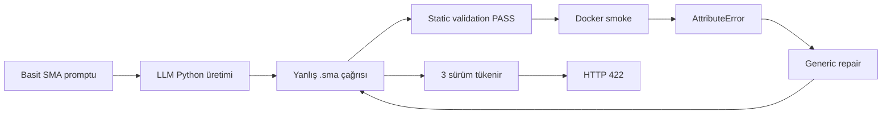
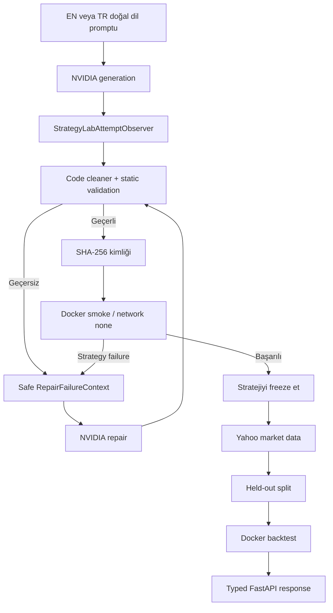
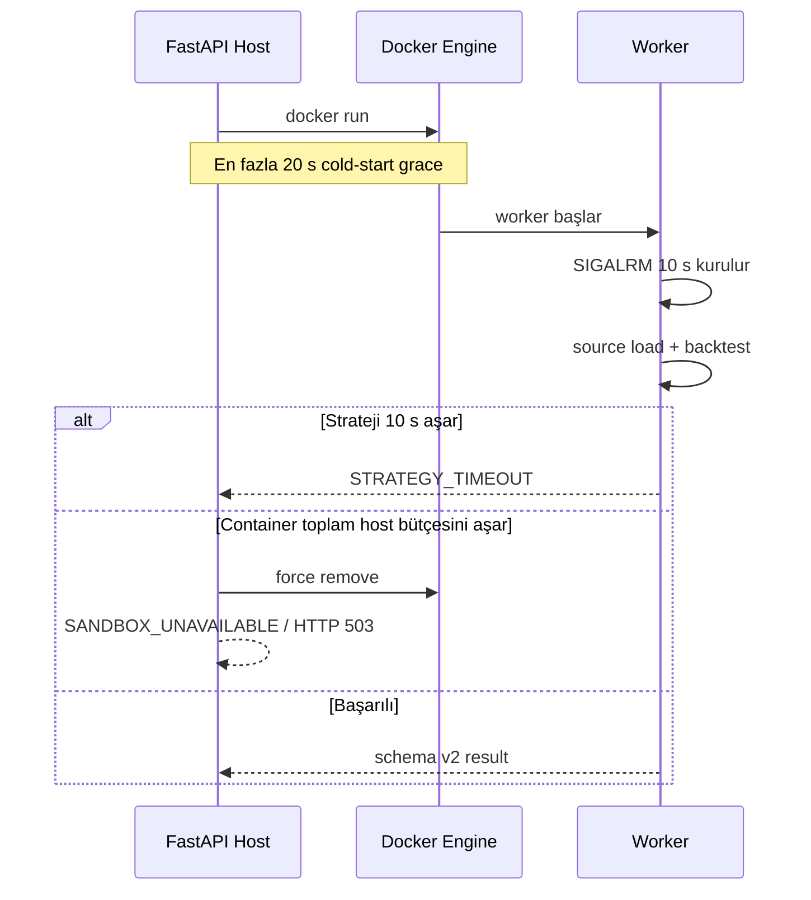
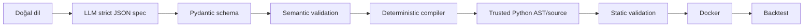

# Strategy Lab Backend Hardening — Teknik ve Mantıksal Açıklama

> [!summary] Kısa sonuç
> Strategy Lab’in rastlantısal HTTP 422 üretmesinin ana nedeni strateji fikri
> değil, LLM’nin sürekli yanlış `ta` API’si üretmesiydi. Prompt sözleşmesi,
> repair bağlamı, Docker worker protokolü, timeout ayrımı ve ölçüm altyapısı
> sertleştirildi. Canonical stratejiler 7/7 Docker smoke testini geçti; fakat
> 180 gerçek çağrılık kabul matrisi provider kesintileri ve Türkçe MACD
> first-pass düşüşü nedeniyle **FAIL** oldu. Bu nedenle sistem **deploy edilmedi**.

## 1. Bu çalışma neden gerekliydi?

Basit bir SMA20/SMA50 crossover stratejisi zaman zaman aşağıdaki sonuçla
bitiyordu:

```text
HTTP 422
Strateji güvenli doğrulama aşamalarını geçemedi.
```

Örnek İngilizce niyet:

```text
Buy when the 20-day moving average crosses the 50-day moving average upwards,
close the position when it crosses downwards.
```

Örnek Türkçe niyet:

```text
20 günlük hareketli ortalama 50 günlük hareketli ortalamayı yukarı kestiğinde al,
aşağı kestiğinde pozisyonu kapat.
```

Bu iki cümle deterministik olarak aynı işlem mantığına karşılık gelmeliydi:

```python
cross_up = fast[-2] <= slow[-2] and fast[-1] > slow[-1]
cross_down = fast[-2] >= slow[-2] and fast[-1] < slow[-1]
```

Sorun, kullanıcı niyetinin zor olması değildi. Sorun, doğal dilden doğrudan
Python üretme sınırında aynı basit niyetin farklı ve bazen geçersiz teknik
uygulamalara dönüşmesiydi.

> [!important] Tanı prensibi
> Kod değiştirilmeden önce arıza tekrarlandı. Böylece “promptu biraz daha iyi
> yazalım” varsayımıyla hareket etmek yerine generated source, static validation,
> Docker smoke ve HTTP sonucu üzerinden kanıt toplandı.

## 2. Pre-hardening tanı: gerçekte ne bozuluyordu?

İngilizce ve Türkçe SMA promptu gerçek FastAPI route’u üzerinden 10’ar kez
çalıştırıldı. NVIDIA, production validator, Docker sandbox, Yahoo Finance ve
backtest bileşenleri mock kullanılmadan devredeydi.

| Dil | Başarı | HTTP 422 | HTTP 502 | Üretilen sürüm |
|---|---:|---:|---:|---:|
| İngilizce | 0/10 | 10/10 | 0/10 | 30 |
| Türkçe | 0/10 | 9/10 | 1/10 | 28 |

58 generated version’ın tamamında aynı hata bulundu:

```python
# Yanlış
SMAIndicator(...).sma()

# Doğru
SMAIndicator(...).sma_indicator()
```

### Neden static validation bunu yakalamadı?

Static validator’ın görevi ağırlıklı olarak şunlardı:

- Python syntax kontrolü;
- import allowlist;
- güvenlik açısından yasak çağrılar;
- `GeneratedStrategy`, `init()` ve `next()` interface’i;
- look-ahead kalıpları.

`SMAIndicator` izinli bir sınıftı ve `.sma()` sözdizimsel olarak geçerliydi.
AST, üçüncü taraf sınıfın gerçekten böyle bir methodu olup olmadığını type-check
etmiyordu. Bu nedenle kaynak “static valid” oluyor, ancak Docker içinde gerçek
çalıştırmada `AttributeError` üretiyordu.



### Kök neden kümeleri

1. **Eksik generation contract:** Exact `ta` method adları ve veri adapter
   zorunlulukları yeterince açık değildi.
2. **Bağlamsız repair:** Repair yalnız genel hata metni görüyor, failure stage,
   exception sınıfı ve indicator family bilgisini bilmiyordu.
3. **Static/runtime sınırı:** Güvenli AST kontrolü, runtime API uyumluluğunun
   yerine geçemezdi.
4. **Dil eşdeğerliği açık değildi:** İngilizce ve Türkçe aynı semantiğe
   normalize edilmesi gereken iki giriş olarak contract içinde tanımlanmamıştı.

## 3. Yeni uçtan uca çalışma mantığı



Bu akışta iki kritik güvenlik sınırı değişmedi:

- Generated Python FastAPI host sürecinde çalıştırılmaz.
- Held-out piyasa verisinden gelen failure, LLM repair promptuna geri gönderilmez.

İkinci kural veri sızıntısını ve test dönemine göre strateji “öğretme” riskini
önler.

## 4. Prompt contract nasıl sertleştirildi?

İlgili dosyalar:

- `app/llm/prompt_builder.py`
- `app/llm/prompt_examples.py`

Prompt artık compositional bir sözleşmedir. Modelden yalnız bir sınıf adı istemek
yerine Python ile backtesting runtime arasındaki uyumluluk şartlarını tarif eder.

### Zorunlu sınıf ve emir kuralları

```text
GeneratedStrategy(Strategy)
init() zorunlu
next() zorunlu
Strategy.__init__ override yasak
long entry -> self.buy()
long exit -> self.position.close()
self.sell() long exit olarak yasak
```

### Zorunlu indicator adapter modeli

`backtesting.py` veri dizileri doğrudan pandas Series değildir. Bu nedenle model
şu dönüşümü uygulamak zorundadır:

```python
def sma_array(values, window):
    series = pd.Series(values)
    return SMAIndicator(series, window=window).sma_indicator().to_numpy()

class GeneratedStrategy(Strategy):
    def init(self):
        self.fast = self.I(sma_array, self.data.Close, 20)
        self.slow = self.I(sma_array, self.data.Close, 50)
```

Mantık şudur:

```text
backtesting array
-> pandas.Series
-> ta indicator
-> aynı uzunlukta NumPy-compatible array
-> self.I ile kayıt
```

### Exact API sözleşmesi

| Aile | İzin verilen canonical çağrı |
|---|---|
| RSI | `RSIIndicator(...).rsi()` |
| SMA | `SMAIndicator(...).sma_indicator()` |
| EMA | `EMAIndicator(...).ema_indicator()` |
| MACD | `.macd()` ve `.macd_signal()` |
| Bollinger | `.bollinger_lband()`, `.bollinger_mavg()`, `.bollinger_hband()` |
| Stochastic | `.stoch()` ve `.stoch_signal()` |
| ATR | `.average_true_range()` |

### Crossover neden `[-2]` ve `[-1]` kullanıyor?

Yalnız mevcut barı karşılaştırmak “şu anda fast slow’dan büyük” anlamına gelir;
kesme olayını kanıtlamaz. Crossover için hem önceki hem mevcut bar gerekir:

```python
cross_up = fast[-2] <= slow[-2] and fast[-1] > slow[-1]
```

Bu ifade iki koşulu aynı anda kanıtlar:

1. Önceki barda hızlı ortalama aşağıda veya eşitti.
2. Mevcut barda hızlı ortalama yukarı geçti.

Modelin crossover boolean dizilerini ayrıca `self.I` ile üretmesi yasaklandı.
Numeric indicator’lar kaydediliyor; olay mantığı `next()` içinde açıkça kuruluyor.

### Bilingual canonical örnekler

RSI, SMA, EMA, MACD, Bollinger Bands, Stochastic ve ATR için:

- aynı anlama gelen İngilizce prompt;
- aynı anlama gelen Türkçe prompt;
- tek canonical Python implementasyonu

birlikte tutuluyor. Amaç Türkçe girdiyi ayrı bir özellik gibi işlemek değil,
aynı internal trading semantiğine yönlendirmektir.

## 5. Repair mekanizması neden ve nasıl değişti?

İlgili dosyalar:

- `app/llm/repair_context.py`
- `app/llm/nvidia_client.py`
- `app/services/strategy_service.py`
- `app/services/strategy_lab_service.py`

Önceden repair’in gördüğü bilgi genel bir hata listesine yakındı. Yeni internal
model immutable’dır:

```python
RepairFailureContext(
    stage="smoke",
    failure_type="AttributeError",
    indicator_families=("SMA",),
    safe_findings=("GeneratedStrategy güvenli runtime testinde çalıştırılamadı.",),
    compatibility_guidance=(
        "Convert backtesting arrays to pandas.Series inside the helper.",
        "Return a NumPy-compatible array of identical length.",
        "Use SMAIndicator(...).sma_indicator().",
    ),
)
```

### Indicator family nasıl bulunuyor?

1. Generated source yalnız AST ile incelenir; çalıştırılmaz.
2. Class, import ve attribute adlarından RSI/SMA/EMA/MACD vb. belirlenir.
3. Syntax parse edilemiyorsa normalize prompt anahtar kelimeleri fallback olur.

### Repair’e ne gönderilmez?

> [!danger] Kesinlikle yasak repair verileri
> - raw exception mesajı ve traceback;
> - Docker komutu veya container ayrıntısı;
> - environment değişkenleri;
> - NVIDIA API key;
> - piyasa veri satırları;
> - held-out test sonucu.

Syntax parse tamamen başarısız olduğunda validator alt flag’leri de false olur.
Bu durum daha önce beş ayrı hata türü gibi görünebiliyordu. Yeni önceliklendirme:

```python
if not validation.syntax_valid:
    return "SyntaxValidationError"
```

Repair böylece asıl problemi tek ve temiz sinyalle görür.

## 6. Sandbox protocol v2

İlgili dosyalar:

- `app/runtime/models.py`
- `app/runtime/docker_executor.py`
- `sandbox/worker.py`

Worker artık runtime exception metnini değil yalnız allowlisted sınıfını döndürür:

```text
AttributeError
TypeError
ValueError
IndexError
KeyError
RuntimeError
ZeroDivisionError
OverflowError
UnknownRuntimeError
```

Örnek güvenli worker sonucu:

```json
{
  "schema_version": 2,
  "success": false,
  "stage": "smoke",
  "error_code": "STRATEGY_RUNTIME_ERROR",
  "error_message": "GeneratedStrategy izole backtest sırasında çalıştırılamadı.",
  "safe_failure_type": "AttributeError"
}
```

Bu bilgi repair için yeterli, secret veya runtime içeriği sızdırmak için yetersizdir.

### `TypeError` sınıflandırma düzeltmesi

Worker’ın önceki yapısında runtime sırasında oluşan her `TypeError`, interface
hatası sanılabilirdi. Interface yükleme hataları özel internal sınıflara ayrıldı:

```text
StrategyClassMissing
StrategyInterfaceMismatch
```

Böylece strateji gerçekten çalışırken oluşan `TypeError`, güvenli runtime hata
sınıfı olarak korunur.

## 7. Docker cold-start ile strateji timeout neden ayrıldı?

Ana matriste bazı doğru stratejiler ilk Docker smoke’unda 10 saniyeyi aşmış,
ikinci denemede yaklaşık 0,1 saniyede çalışmıştı. Bu, stratejinin yavaşlığından
değil Docker Desktop cold-start gecikmesinden kaynaklanıyordu.

Önceki mantık:

```text
Docker başlatma + worker load + strateji çalışma <= 10 saniye
```

Bu yaklaşım altyapı gecikmesini strateji hatası gibi gösteriyor ve gereksiz LLM
repair harcıyordu.

Yeni mantık:

```text
Worker içi strateji bütçesi = SANDBOX_TIMEOUT_SECONDS = 10 s
Host cold-start payı        = SANDBOX_STARTUP_GRACE_SECONDS = 20 s
```

Worker Linux içinde `SIGALRM` kullanarak source load + backtest süresini 10
saniyede sınırlar. Host, container’ın ayağa kalkması için ayrıca bounded grace
tanır.



> [!note] Güvenlik neden zayıflamadı?
> Cold-start grace generated source’a ek CPU süresi vermez. Stratejinin gerçek
> çalışma sınırı worker içinde hâlâ 10 saniyedir. Ayrıca network-none, read-only,
> non-root, capability drop ve kaynak limitleri korunmuştur.

## 8. NVIDIA provider timeout ve retry düzeltmesi

İlgili dosyalar:

- `app/config.py`
- `.env.example`
- `app/llm/nvidia_client.py`

Gerçek matris sırasında bir provider çağrısının route timeout’undan daha uzun
bekleyebildiği görüldü. Nedeni `AsyncOpenAI` için explicit timeout ve retry
politikasının tanımlanmamış olmasıydı.

Yeni ayarlar:

```text
NVIDIA_REQUEST_TIMEOUT_SECONDS=120
max_retries=0
```

Mantık:

- Tek scheduled run’ın kaç gerçek provider denemesi yaptığı belirsiz kalmaz.
- SDK’nın örtük retry’ı latency ve failure oranını gizlemez.
- Provider askıda kalırsa istek sınırlı sürede güvenli HTTP 502 yoluna çıkar.
- API key hâlâ yalnız backend environment’ındadır; Flutter’a veya rapora girmez.

Reliability runner, `ASGITransport` timeout davranışından bağımsız olarak route’u
ayrıca `asyncio.wait_for` ile wall-clock olarak sınırlar.

## 9. Attempt observer ve reliability runner

İlgili dosyalar:

- `app/services/strategy_lab_observer.py`
- `scripts/run_strategy_reliability_matrix.py`

`StrategyLabAttemptObserver` production’da varsayılan olarak `None` olan internal
bir gözlem arayüzüdür. Public FastAPI sözleşmesini değiştirmez.

Observer şu olayları yakalayabilir:

```text
on_generated
on_validation
on_smoke
on_repair_requested
on_backtest
```

Generated code yalnız opt-in reliability runner’da ignored report dizinine
yazılır. Normal production akışı generated source loglamaz.

Runner’ın ölçüm prensipleri:

- gerçek FastAPI route;
- gerçek NVIDIA, Docker, Yahoo ve backtest;
- sequential çağrılar;
- gizli retry yok;
- her scheduled çağrı başarı veya hata olarak sayılır;
- per-attempt source, hash, validation, smoke ve repair context kaydı;
- artifact’lar `reports/strategy-reliability/` altında ve Git ignored.

## 10. Test ve ölçüm sonuçları

### Pre-hardening

```text
EN SMA: 0/10 final başarı
TR SMA: 0/10 final başarı
58/58 generated version: yanlış .sma() ve Docker AttributeError
```

### 180 gerçek post-hardening çağrı

| Prompt | HTTP 200 | First-pass | Repair 0/1/2 | Kapı |
|---|---:|---:|---:|---|
| EN RSI | 15/20 | 15/20 | 20/0/0 | FAIL |
| EN SMA | 20/20 | 19/20 | 19/1/0 | PASS |
| EN EMA | 20/20 | 20/20 | 20/0/0 | PASS |
| EN MACD | 20/20 | 20/20 | 20/0/0 | PASS |
| EN Bollinger + RSI | 20/20 | 20/20 | 20/0/0 | PASS |
| TR RSI | 20/20 | 19/20 | 19/1/0 | PASS |
| TR SMA | 20/20 | 20/20 | 20/0/0 | PASS |
| TR EMA | 20/20 | 20/20 | 20/0/0 | PASS |
| TR MACD | 17/20 | 12/20 | 15/5/0 | FAIL |

Toplam sonuç:

```text
180 scheduled run
172 HTTP 200
165 first-pass
8 NVIDIA/provider HTTP 502
7 tek-repair koşusu
0 çift-repair koşusu
0 unknown/unclassified failure
```

Yedi repair’in dağılımı:

- 3 Docker cold-start host timeout;
- 4 Türkçe MACD prose/Markdown fence kaynaklı syntax failure.

Generation’a ulaşan 172 çağrının tamamı finalde HTTP 200 olmuştur. Buna rağmen
deployment kapısı scheduled çağrıları ölçtüğü için provider HTTP 502’ler başarı
sayılmamıştır.

### Final kod doğrulamaları

```text
python -m pytest                         -> 146 passed
check_sandbox.py                        -> schema v2 success
check_canonical_strategies.py           -> 7/7 static + Docker smoke
check_sandbox_failure_protocol.py       -> timeout + safe AttributeError PASS
check_nvidia_connection.py              -> başarılı
Final EN/TR SMA küçük gerçek matris      -> 2/2 first-pass
```

> [!warning] Ölçüm sınırı
> 180-run ana matristen sonra provider timeout ve Docker cold-start ayrımı final
> koda eklendi. Final kodla küçük EN/TR SMA smoke’u geçti, fakat tam 180 koşu
> yeniden PASS edilmedi. Bu nedenle final kod “production-proven” kabul edilmez.

## 11. Dosya bazında değişiklik haritası

| Dosya | Rol |
|---|---|
| `app/llm/prompt_builder.py` | Bilingual generation ve güvenli repair sözleşmesi |
| `app/llm/prompt_examples.py` | Yedi canonical indicator ailesinin EN/TR örnekleri |
| `app/llm/repair_context.py` | Immutable failure context, family detection ve guidance |
| `app/llm/nvidia_client.py` | 120 s timeout, sıfır retry, tipli repair API’si |
| `app/config.py` | Provider timeout ve sandbox cold-start yapılandırması |
| `app/runtime/models.py` | Sandbox schema v2 ve safe failure enum |
| `app/runtime/docker_executor.py` | Worker timeout alanı, host grace ve fail-closed kontrol |
| `sandbox/worker.py` | Worker-içi SIGALRM ve güvenli exception sınıflandırması |
| `app/services/strategy_lab_service.py` | Attempt döngüsü, context üretimi, observer olayları |
| `app/services/strategy_lab_observer.py` | Opt-in internal gözlem protokolü |
| `scripts/run_strategy_reliability_matrix.py` | Gerçek 9x20 reliability runner |
| `scripts/check_canonical_strategies.py` | 7 family static + Docker smoke |
| `scripts/check_sandbox_failure_protocol.py` | Runtime timeout ve hata-sızıntısı regresyonu |
| `tests/test_*.py` | Contract, repair, service, protocol ve config regresyonları |

Public `/api/v1/strategy-lab/run` request/response sözleşmesi ve Flutter istemcisi
bu hardening sırasında değiştirilmedi.

## 12. Neden structured JSON + deterministic compiler öneriliyor?

Doğrudan Python üretiminde model hâlâ şunları rastlantısal seçiyor:

- import biçimi;
- exact method adı;
- pandas/NumPy adapter;
- class/interface yapısı;
- crossover implementation’ı;
- yalnız kod yerine prose/fence dönüp dönmemesi.

İkinci nesil tasarım bu teknik kararları modelden alır:



Örneğin LLM yalnız şu semantiği verir:

```json
{
  "kind": "crossover",
  "direction": "above",
  "left": {"kind": "indicator", "indicator_id": "fast", "output": "value"},
  "right": {"kind": "indicator", "indicator_id": "slow", "output": "value"}
}
```

LLM bar offset veremez. Compiler bunu her zaman trusted `[-2]/[-1]` koduna
çevirir. Aynı şekilde indicator adapter ve method adları repository-owned
template’lerden gelir.

Bu mimari şunları maddi biçimde azaltır:

- syntax ve Markdown/prose failure;
- yanlış import/interface;
- `.sma()` gibi yanlış method;
- pandas/backtesting adapter uyumsuzluğu;
- current-only crossover;
- modelin güvenlik politikasını kod içinde yanlış uygulaması.

Çözemediği problemler:

- NVIDIA provider kesintisi;
- doğal dil niyetinin yanlış anlaşılması;
- Yahoo veri availability/kalitesi.

Ayrıntılı schema ve migration planı için: [[structured_strategy_v2]].

## 13. Deployment kararı

> [!failure] Karar: UNSAFE — deploy etme
> Ana 180-run matris `GATE=FAIL` oldu. EN-RSI provider kesintileri nedeniyle
> 20/20 final kapısını, TR-MACD ise hem provider hem first-pass kapısını kaçırdı.
> Final timeout/cold-start değişiklikleri sonrasında tam matris yeniden PASS
> edilmeden deployment güvenli kabul edilmemelidir.

Deployment için minimum tekrar kapıları:

- her canonical promptta 20/20 final HTTP 200;
- her promptta en az 19/20 first-pass;
- unknown failure sıfır;
- final Docker image ile bütün koşular;
- provider, sandbox ve market-data olaylarının ayrı raporlanması;
- `python -m pytest`, sandbox, NVIDIA ve gerçek route kontrollerinin tamamı PASS.

## 14. İlgili notlar ve artifacts

- Ayrıntılı resmi rapor: [[strategy_lab_hardening_report]]
- İkinci nesil tasarım: [[structured_strategy_v2]]
- Pre-hardening artifact:
  `reports/strategy-reliability/20260824-201514/pre-hardening/`
- 180-run ana artifact:
  `reports/strategy-reliability/20260824-210644/post-hardening/`
- Final küçük EN/TR SMA smoke:
  `reports/strategy-reliability/20260825-005449/post-hardening/`

## 15. Tek cümlelik zihinsel model

> [!quote]
> LLM kullanıcı niyetini yorumlayabilir; fakat API methodu, veri adapter’ı,
> crossover mekaniği, execution sınırı ve güvenlik kararı mümkün olduğunca
> deterministik backend katmanlarının sorumluluğunda olmalıdır.
