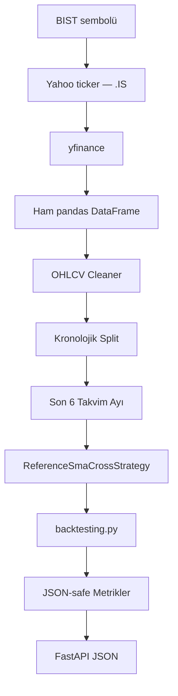

# Day 4 — BIST Piyasa Verisi ve Güvenilir Backtest

## Day 4'ün amacı ve güvenlik sınırı

Day 4, tam LLM → backtest entegrasyonunun son aşaması değildir.

Day 4'te yalnızca güvenilir repository-owned referans stratejisi çalıştırılır.

LLM tarafından üretilen Python kodu Day 4 FastAPI sürecinde çalıştırılmaz.

Bu aşamanın amacı aşağıdaki altyapının gerçek piyasa verisi ve güvenilir kodla
çalıştığını göstermektir:



Sonraki aşamalarda runtime test, indikatör referans karşılaştırması,
güvenli/sınırlı execution ve LLM-strategy/backtest köprüsü geliştirilecektir.

## Yahoo Finance, yfinance ve BIST `.IS`

Yahoo Finance piyasa verisini sunan servistir. `yfinance`, bu verilere Python'dan
erişmek için kullanılan bağımsız ve topluluk tarafından geliştirilen istemcidir;
Yahoo tarafından resmî olarak desteklenmez.

Yahoo Finance, Borsa İstanbul hisselerini `.IS` suffix'iyle tanımlar:

```text
THYAO → THYAO.IS
ASELS → ASELS.IS
```

BIST endpoint'i keyfî global ticker kabul etmez. Sembol kırpılır, uppercase
yapılır ve yalnızca merkezi allowlist'te bulunuyorsa `.IS` eklenir.

## OHLCV ve pandas DataFrame

İndirilen günlük her satır bir işlem gününü, kolonlar ise şunları temsil eder:

- `Open`: günün açılış fiyatı
- `High`: gün içinde görülen en yüksek fiyat
- `Low`: gün içinde görülen en düşük fiyat
- `Close`: günün kapanış fiyatı
- `Volume`: işlem hacmi

`auto_adjust=True`, fiyatların bölünme ve temettü gibi kurumsal işlemlere göre
düzeltilmesini sağlar. Veriler pandas `DataFrame` içinde tutulur. Satırların
`DatetimeIndex` olması her barı kendi piyasa tarihiyle ilişkilendirir.

## Tamamlanmış günlük bar politikası

Tarih aralığı BIST yerel takviminde yaklaşık üç yıl önce başlayıp **bugün**
biter. yfinance `end` tarihini exclusive kabul eder. Böylece bugünün potansiyel
olarak henüz tamamlanmamış günlük mumu istenmez.

```text
start = today - 3 calendar years
end = today  # exclusive
```

Yarın `end` olarak verilerek bugünkü bar zorla veri setine eklenmez. Bu politika,
tarihsel backtest'in yalnızca tamamlanmış mumlarla çalışmasını sağlar. Inspection
script'i son dönen tamamlanmış piyasa tarihini ayrıca gösterir.

## OHLCV temizliği

Cleaner şu işlemleri sırasıyla uygular:

1. Ham DataFrame'in kopyasını alır.
2. Basit veya MultiIndex kolonları standart OHLCV adlarına dönüştürür.
3. Yalnızca gerekli beş kolonu tutar.
4. Değerleri `pandas.to_numeric(errors="coerce")` ile sayıya çevirir.
5. Pozitif/negatif sonsuzluğu missing value yapar.
6. Kullanılamayan missing satırları çıkarır.
7. Tarihleri `DatetimeIndex` hâline getirir ve çözülemeyenleri siler.
8. Timezone bilgisini yerel takvim gününü kaydırmadan kaldırır.
9. Aynı tarihte son gelen kaydı tutar ve tarihleri artan sıraya dizer.
10. Pozitif fiyat, negatif olmayan hacim ve OHLC ilişkilerini doğrular.

`High`, `Low` değerinden; `Open` veya `Close` fiyatından küçük olamaz. `Low`,
`Open` veya `Close` fiyatından büyük olamaz. Yapısal olarak imkânsız satırlar
sessizce kabul edilmez ve üretim kodu sentetik piyasa satırı oluşturmaz.

## Neden zaman serisi rastgele bölünmez?

Finansal veride rastgele split yapılırsa gelecekteki bir gün geçmiş veriyle aynı
eğitim/history tarafına karışabilir. Bu durum look-ahead bias yaratır ve gerçekçi
olmayan performans sonuçlarına yol açar.

Day 4 temiz verinin en son tamamlanmış piyasa tarihini kullanır:

```text
cutoff = latest_market_date - 6 calendar months
history = index < cutoff
test = index >= cutoff
```

Yaklaşık üç yıllık veri bu şekilde yaklaşık 30 aylık ayrılmış history ve son altı
takvim aylık görülmemiş test dönemine dönüşür. History boş olamaz ve testte en az
60 günlük bar bulunmalıdır. Backtest yalnızca test DataFrame'ini alır.

## Güvenilir SMA referans stratejisi

`ReferenceSmaCrossStrategy`, repository içinde yazılmış ve gözden geçirilebilir
trusted uygulama kodudur:

- Hızlı SMA: 10 bar
- Yavaş SMA: 20 bar
- Hızlı SMA yukarı keserse ve pozisyon yoksa alış
- Hızlı SMA aşağı keserse mevcut pozisyonu kapatma
- Long-only

SMA yalnızca mevcut ve geçmiş kapanış değerlerinin rolling ortalamasıdır. Ağ,
dosya sistemi, negatif shift veya gelecek veri kullanılmaz.

`ta` paketi planlanan RSI, EMA, MACD, Bollinger Bands, Stochastic ve ATR sistemi
için dependency olarak bulunur. Day 4 referans SMA stratejisi gereksiz yere `ta`
paketine bağlanmaz.

## Backtesting.py yapılandırması

```python
Backtest(
    data,
    ReferenceSmaCrossStrategy,
    cash=initial_cash,
    commission=commission,
    exclusive_orders=True,
    trade_on_close=False,
    finalize_trades=True,
)
```

- `initial_cash`: Simülasyonun başlangıç bakiyesidir.
- `commission`: İşlem başına oransal komisyon modelidir.
- `exclusive_orders=True`: Aynı anda tek yönlü aktif pozisyon davranışı sağlar.
- `trade_on_close=False`: Market emirleri mevcut kapanış yerine sonraki bar
  açılışında işlenir.
- `finalize_trades=True`: Test sonunda açık kalan pozisyonu son mevcut barda
  raporlama amacıyla kapatır.

Bu bir tarihsel simülasyondur ve altı aylık test penceresinin tanımlı bir sonu
vardır. Bu nedenle açık pozisyonun final barda kapatılması, son işlemin performans
istatistiklerine tutarlı biçimde katılmasını sağlar.

## Performans metrikleri

- **Return:** Başlangıç bakiyesine göre toplam yüzdesel getiri.
- **Buy & Hold Return:** Aynı dönemde varlığı alıp tutmanın getirisi.
- **Net Profit:** Final equity ile initial cash arasındaki fark.
- **Trade Count:** Tamamlanan işlem sayısı.
- **Win Rate:** Kârlı işlemlerin yüzdesi.
- **Max Drawdown:** Equity zirvesinden görülen en büyük yüzdesel düşüş.
- **Sharpe Ratio:** Toplam oynaklığa göre risk düzeltilmiş getiri.
- **Sortino Ratio:** Yalnızca aşağı yönlü riski kullanan risk düzeltilmiş getiri.
- **Profit Factor:** Brüt kârın brüt zarara oranı.
- **Best/Worst Trade:** En iyi ve en kötü tek işlem getirileri.
- **Average Trade Duration:** İşlemlerin ortalama açık kalma süresi.
- **Exposure Time:** Stratejinin piyasada pozisyonda kaldığı zaman yüzdesi.

NumPy/pandas sayıları JSON-safe Python değerlerine dönüştürülür. `NaN`, `NaT`
ve sonsuz değerler `null` olur.

Sıfır işlem meşru olabilir: Altı aylık dönemde SMA kesişimi oluşmayabilir. Bu
durum backend hatası değildir; işlem sayısı `0`, matematiksel olarak oluşmayan
Win Rate, Sharpe veya Profit Factor gibi değerler `null` olur.

## API ve manuel inceleme

```powershell
Invoke-RestMethod -Method Post `
  -Uri http://127.0.0.1:8000/api/v1/backtests/bist `
  -ContentType "application/json" `
  -Body '{"symbol":"THYAO","initial_cash":100000,"commission":0.002}'
```

Yahoo'dan gelen veriyi aynı production modülleriyle incelemek için:

```powershell
cd backend
python scripts/inspect_bist_data.py THYAO
```

## Sınırlamalar ve uyarı

Yahoo/yfinance verisinin gerçek zaman, doğruluk veya kesintisiz erişim garantisi
yoktur. Kullanım Yahoo koşullarına uygun olmalıdır. Bu sistem eğitim ve araştırma
amaçlıdır; yatırım tavsiyesi vermez, canlı broker'a bağlanmaz ve gerçek para emri
göndermez. Geçmiş performans gelecekteki performansı garanti etmez.
