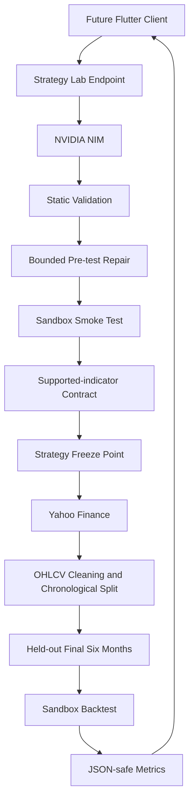

# Day 5 — Güvenli Runtime ve Strategy Lab

## Amaç ve güven sınırı

Day 5, doğal dil isteğinden üretilen stratejiyi statik doğrulama, izole teknik
smoke testi ve görülmemiş BIST verisindeki backtest ile tek backend akışında
birleştirir. Üretilen Python kaynak kodu güvenilir uygulama kodu değildir ve
FastAPI Python sürecinde hiçbir zaman import edilmez veya çalıştırılmaz.

`ast.parse()` bilinen riskli yapıları bulmaya yardımcı olur fakat tek başına bir
sandbox değildir. Alias, Python nesne modeli ve kütüphane iç davranışları gibi
tüm olasılıkları statik olarak kanıtlayamaz. Bu nedenle runtime aşaması ayrı bir
Docker konteynerinde gerçekleşir.



## Trusted host ve untrusted sandbox

Host süreç; request doğrulama, NVIDIA çağrısı, AST kontrolü, Yahoo indirme,
OHLCV temizliği, split ve response oluşturmayı yapar. Generated source için
`exec`, `eval`, `compile` veya dinamik import kullanmaz.

Sandbox worker yalnızca konteyner içinde:

1. Read-only `strategy.py`, `data.csv` ve `request.json` dosyalarını okur.
2. `GeneratedStrategy` sınıfını yükler.
3. `Strategy` inheritance ve `init`/`next` sözleşmesini doğrular.
4. `backtesting.py` çalıştırır.
5. Tek bir küçük, versiyonlu JSON mesajı üretir.

Konteyner `--network=none`, read-only root filesystem, non-root kullanıcı,
capability drop, no-new-privileges, CPU/bellek/PID/zaman/çıktı sınırları,
`--ipc=none`, `nofile=64:64` ve 32 MB `/tmp` ile çalışır. Repository, `.env`,
Docker socket, home dizini veya secret mount edilmez. Docker kullanılamıyorsa
generated source için yerel fallback yoktur.

`print()` generated source içinde yasaktır. Stratejinin console çıktısına ihtiyacı
yoktur; worker iletişimi tek JSON mesajıdır. Bu kural output protokolünü sade
tutar ve kazara çıktı taşmasını azaltır. Asıl güven sınırları izolasyon, kapalı
ağ, read-only filesystem, non-root execution, kaynak limitleri ve AST filtresidir.

## Worker protokolü ve kaynak kimliği

Worker sözleşmesinin mevcut versiyonu `schema_version=1` değeridir. Host, farklı
veya bozuk versiyonu `INVALID_SANDBOX_OUTPUT` olarak reddeder. Traceback, stderr,
Docker komutu ve geçici dosya yolu public sözleşmede bulunmaz.

Her aday kaynak için SHA-256 hesaplanır. Smoke sonucundaki hash doğrulandıktan
sonra kod frozen olur. Gerçek backtest worker'ı dosyanın hash'ini yeniden hesaplar.
Bu sayede smoke testinden geçen kod ile held-out backtest kodunun byte-identical
olduğu doğrulanır. Hash API istemcisine dönmez.

## Repair sınırı ve held-out test data isolation policy

`MAX_STRATEGY_VERSIONS=3`, ilk üretim dâhil en fazla üç sürüm demektir:

- Version 1: ilk NVIDIA üretimi
- Version 2: ilk repair
- Version 3: ikinci ve son repair

Statik validation veya deterministik smoke failure repair başlatabilir. Repair
mesajı yalnızca özgün prompt, mevcut generated source ve kısa güvenli teknik
bulguları içerir.

Static validation ve smoke başarılı olduğunda **strategy freeze point** oluşur.
Yahoo verisi ancak bundan sonra indirilir. Son altı takvim ayı gerçek held-out
değerlendirme dönemidir. Bu dönemde bulunan runtime hatası NVIDIA'ya gönderilmez,
repair yapılmaz ve yeni sürüm aynı test setinde denenmez. Böylece test döneminden
stratejiye dolaylı bilgi sızması ve overfitting engellenir.

NVIDIA'ya hiçbir zaman Yahoo OHLCV satırları, test tarihleri, held-out runtime
hatası, performans metriği veya backtest sonucu aktarılmaz.

## Smoke testi ve gerçek BIST backtest'i

Smoke testi 320 deterministik business-day OHLCV barı kullanır. Sorusu şudur:
“Kod teknik olarak yüklenip `init()`/`next()` ve backtesting.py ile çalışabiliyor
mu?” Smoke failure repair edilebilir.

Gerçek backtest mevcut Day 4 politikasını kullanır: yaklaşık üç yıllık tamamlanmış
günlük Yahoo verisi temizlenir, son altı takvim ayı ayrılır ve frozen strateji bu
veride yalnızca bir kez değerlendirilir. Açık pozisyonlar tanımlı tarihsel pencere
sonunda `finalize_trades=True` ile rapora katılır. Gerçek test failure repair
edilemez.

## Supported-indicator contract

Desteklenen indikatörler SMA, EMA, RSI, MACD, Bollinger Bands, Stochastic ve
ATR'dir. Prompt standart hesaplarda onaylı `ta.trend`, `ta.momentum` ve
`ta.volatility` implementasyonlarını tercih ettirir. Generated kod `ta` kullanırsa
hesaplama onaylı referans kütüphaneye devredilmiş olur.

Bu sözleşme, keyfî özel formüllerin matematiksel olarak doğrulandığı anlamına
gelmez. Kapsamlı sayısal referans karşılaştırması bağımsız bir gelecek fazıdır.

## CSV veri aktarımı

Sandbox market-data aktarımı `data.csv` kullanır. Altı aylık günlük BIST OHLCV
çok küçük olduğu için CSV basit, incelenebilir ve ek binary dependency istemeyen
uygun formattır. Day 5'e `pyarrow` veya `fastparquet` eklenmez. Gelecekte büyük
intraday veri kullanılırsa Parquet gerçek iş yükü üzerinde ölçüm yapılarak
değerlendirilebilir; sabit hız veya bellek kazancı garanti edilmez.

## API

- `POST /api/v1/strategy-lab/run`: generation, validation, smoke, held-out
  backtest ve metrikleri tek response'ta döndürür.
- `GET /api/v1/strategy-lab/capabilities`: sıralı BIST sembolleri, supported
  indicators, varsayılan cash/commission ve prompt limitlerini döndürür.

`generation.attempt_count` kaç sürüm üretildiğini gösterir;
`generation.repaired`, bu sayı birden büyükse `true` olur. Bu yalnızca teknik
validation/runtime repair bilgisidir; finansal mantığın yanlış olduğu iddia
edilmez.

## Uzun request ve gelecek mobil mimarisi

MVP endpoint'i istemci açısından request/response çalışır:

```text
Flutter → POST /api/v1/strategy-lab/run → bekle → response
```

NVIDIA ve olası repair gecikmesi, konteyner başlangıcı, Yahoo isteği ve backtest
normal REST isteğinden uzun sürebilir. Flutter ileride bilinçli HTTP timeout ile
loading/progress durumu göstermelidir.

Üretim ölçeğinde şu job-resource tasarımı değerlendirilebilir:

```text
POST /api/v1/strategy-lab/jobs
→ 202 Accepted + job_id
→ background execution
→ GET /api/v1/strategy-lab/jobs/{id}
```

Gerçek zamanlı olay ihtiyacı kanıtlanırsa SSE veya WebSocket daha sonra
değerlendirilebilir. Day 5 Redis, Celery, database, polling endpoint'i veya
WebSocket uygulamaz.

## Sınırlamalar ve uyarı

Docker izolasyonu riski ciddi biçimde azaltır fakat production multi-tenant
güvenliğini tek başına kanıtlamaz. Image güncellemeleri, daemon hardening,
deployment politikaları ve kapsamlı indicator comparison sonraki çalışmalardır.
Sistem eğitim/araştırma amaçlıdır; geçmiş performans geleceği garanti etmez ve
gerçek para emri göndermez.
